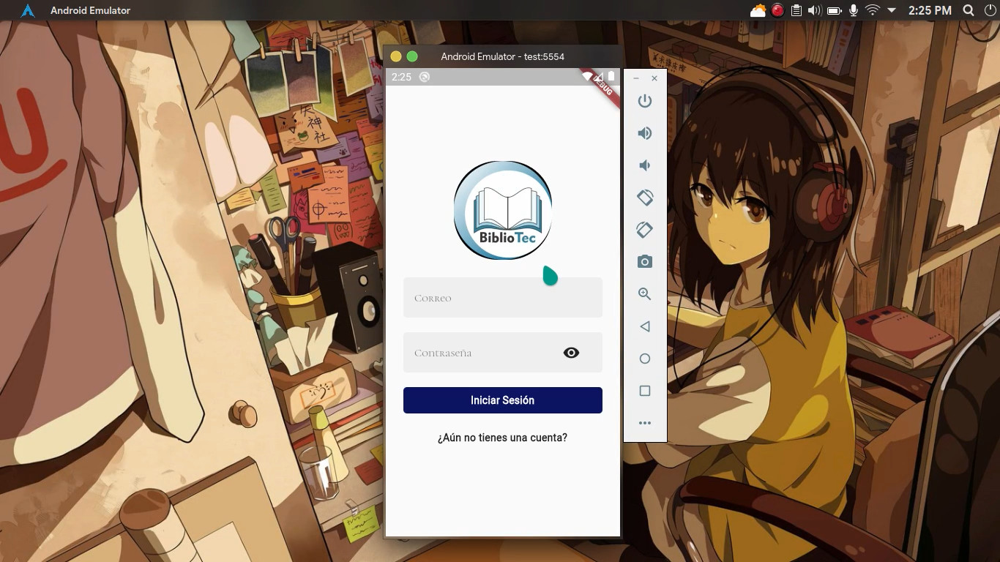
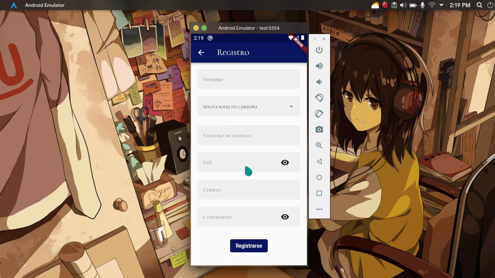
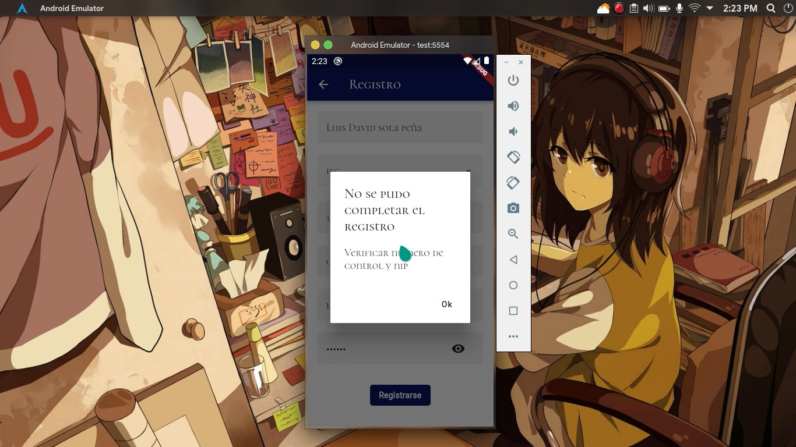
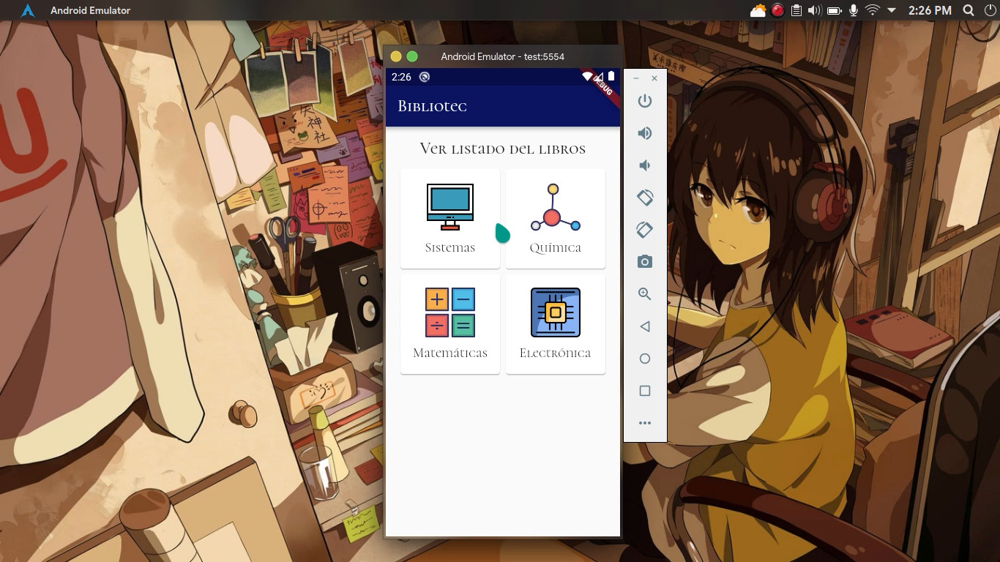
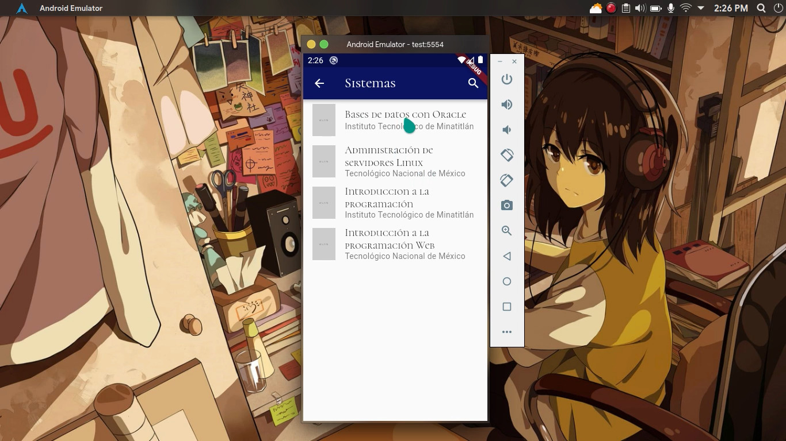

# Bibliotec

## About

Bibliotec was a school project which purpose was to have a practical way to search for books at the Instituto Tecnológico de Minatitlán library without the need of walking into it and search manually.

**The project concluded in a prototype version** that has a login module with registration through firebase and could make api calls to a firebase database with placeholder data. It was made with zero previous knowledge about Flutter and Dart and I was the main developer.

Currently it cannot be run due to some errors caused by some broken code since it hasn't been updated and I'm not willing to fixing it at this moment.

## Screenshots

Here you introduce your student data for signing up, its intention was that the university made use of this information for statistics.

The intention here is that if you weren't a known student at the university you couldn't sign up due to lack of student credentials.

Home screen, here you could select the genre of the book you are looking for.

The actual view of the fetched books for the corresponding genre.

If you think of the application it could be easily extended by adding useful features once we've got the core functionality running.

---

© All rights reserved.
